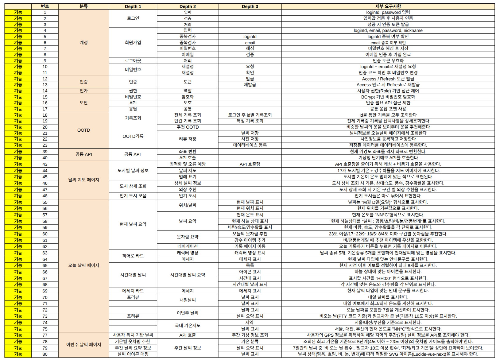

# 프로젝트 README

## 1. 팀소개

  <h2> 귄카 </h2>
  <table border="0" style="border: none; width: 80%;">
    <tr>
      <td align="center">
        
         
        <b> 강윤혜 </b>
         
      </td>
      <td align="center">
        
         
        <b> 양승재 </b>
         
      </td>
      <td align="center">
        
         
        <b> 이인재 </b>
         
      </td>
        <td align="center">
        
         
        <b> 이하경 </b>
         
      </td>
      <td align="center">
        
         
        <b> 정재우 </b>
         
      </td>
    </tr>
  </table>

---

## 2. 기술 스택

### Backend
     

### Frontend
   

### Tool & Collaboration
   

---

## 3. 프로젝트 개요

본 프로젝트는 **날씨 정보를 기반으로 한 서비스 제공 플랫폼**으로,  
사용자는 **회원가입 및 로그인을 통해 개인화된 기능**을 이용할 수 있습니다.

프로젝트는 팀 단위 협업을 전제로 하여  
인증/보안, 외부 API 활용, 프론트엔드 UI 구현을 중심으로 개발되었습니다.

---

## 4. 개발 배경

일상에서 날씨 정보는 자주 활용되지만,  
단순 정보 제공에 그치는 경우가 많다는 점에서 출발하였습니다.

본 프로젝트는 다음을 목표로 기획되었습니다.
- 계정 기반 서비스 구조 경험
- 외부 API 연동을 통한 실시간 데이터 활용
- 프론트엔드와 백엔드 협업 경험 축적

---

## 5. 주요 제공 가치

- 사용자 인증을 통한 개인화 서비스 제공
- 날씨 데이터를 활용한 실용적인 정보 제공
- 역할 분담 기반의 팀 프로젝트 경험
- 인증 및 보안 구조에 대한 실습 경험

---

## 6. 시장 조사

기존 날씨 서비스들은 다음과 같은 특징을 가지고 있습니다.
- 정보 중심의 단순 UI
- 사용자 참여 요소 부족
- 개인화 기능의 제한

본 프로젝트는 이러한 기존 서비스들을 참고하여  
계정 기반 구조와 확장 가능한 기능 설계를 지향하였습니다.

---

## 7. 유사 프로그램

- 네이버 날씨
- 기상청 날씨누리
- AccuWeather

유사 서비스들의 정보 제공 방식을 참고하되,  
본 프로젝트는 학습 목적의 구현과 서비스 구조 이해에 중점을 두었습니다.

---

## 8. 주요 기능

### 8.1 계정 및 인증
- 회원가입 및 로그인 기능
- 비밀번호 해싱 후 저장
- 이메일 인증 기반 비밀번호 재설정
- JWT 기반 인증 (Access / Refresh Token)

### 8.2 날씨 정보 기능
- 외부 API를 통한 날씨 데이터 조회
- 지역 기반 날씨 정보 제공

### 8.3 프론트엔드 UI
- Vue 기반 SPA 구조
- 인증 상태에 따른 화면 분기
- 사용자 친화적인 UI 구성

### 8.4 OOTD
- 데이터베이스와 연결해서 데이터 조회
- 데이터 상세 조회
- 비슷한 날씨에 OOTD 추천
- 오늘의 날씨에 OOTD 등록
---

## 9. 기대 효과

- 사용자 인증 흐름에 대한 이해도 향상
- 프론트엔드·백엔드 분리 구조 경험
- 팀 협업 과정에서의 역할 분담 및 소통 능력 향상
- 실무와 유사한 프로젝트 진행 경험 축적

---

## 10. 스토리보드 (Figma)

- Figma를 활용하여 화면 흐름 및 UI를 설계하였습니다.
- 로그인, 메인 화면, 주요 기능 페이지 흐름을 중심으로 구성하였습니다.

---

## 11. 요구사항 명세서

- 사용자 회원가입 및 로그인 기능 제공
- 인증된 사용자만 주요 기능 접근 가능
- 날씨 정보 조회 기능 제공
- 프론트엔드와 백엔드 간 API 연동
- 공통 응답 포맷을 통한 일관된 데이터 처리

---

## 12. 테스트 케이스

- 회원가입 정상 / 비정상 입력 테스트
- 로그인 성공 / 실패 테스트
- 비밀번호 재설정 흐름 테스트
- 인증 토큰 만료 시 재발급 테스트
- 날씨 API 정상 응답 여부 테스트

---

## 13. 팀원 회고
강윤혜
> 오늘의 날씨 페이지를 맡아 프로젝트를 진행했습니다.
사용자의 긍정적인 경험을 위해 현재 날씨 → 날씨에 맞는 옷차림 → 시간대별 기온 → 다음 페이지로 이동하는 프리뷰가 자연스럽게 이어지도록 화면 흐름을 구성했습니다. 웹의 핵심 목적이 ‘기온에 맞는 옷차림 추천’인 만큼 옷 추천을 중심으로 두되, 날씨 서비스로서 필요한 정보도 충분히 전달할 수 있도록 균형을 맞췄습니다. 또한 오늘 기록하기 버튼과 프리뷰 카드를 통해 관련 페이지로 바로 이동할 수 있게 하여 탐색 편의성을 높였습니다.
어려웠던 점은 Vue와 기상청 API 모두 익숙하지 않아, 응답 데이터를 화면에 맞게 가공하고 상태를 관리하는 과정에서 어려움을 겪었습니다. 특히 기상청 API는 요청 실패나 응답 누락이 발생하는 경우가 있어 디버깅이 어려웠습니다. 이를 보완하기 위해 로딩/에러/데이터 수신 상태 메시지를 화면에 표시하여 개발자뿐 아니라 사용자도 현재 상태를 확인할 수 있도록 개선했습니다.
아쉬운 점은 일부 데이터 가공 로직이 프론트에 집중되어 있어, API 응답 구조가 바뀌면 프론트 수정 범위가 커질 수 있다는 점입니다. 다음에는 백엔드에서 데이터를 목적에 맞게 가공해 내려주고, 프론트는 표시 중심으로 단순화하여 변경에 강한 구조로 개선해보고 싶습니다.

 

양승재
> 이번 프로젝트를 통해 API를 활용하여 프론트엔드에서 데이터를 처리하고, 이를 백엔드 및 데이터베이스와 연동하는 전반적인 흐름을 직접 경험하며 많은 것을 배울 수 있었습니다. 처음에는 프론트엔드와 백엔드를 연결하는 작업이 비교적 단순할 것이라고 생각했지만, 실제로 구현해 보니 요청과 응답 구조를 정확히 이해하고 각 계층 간의 역할을 명확히 구분하는 것이 생각보다 복잡하고 어려운 작업이라는 것을 느꼈습니다.
특히 프론트엔드에서 입력한 데이터를 백엔드의 요청 객체로 전달하는 과정에서 데이터 형식, 타입, 네이밍 규칙 등을 맞추는 부분이 쉽지 않았고, 하나의 기능이 정상적으로 동작하기 위해 프론트엔드, 백엔드, 데이터베이스가 모두 정확하게 연결되어야 한다는 점에서 많은 시행착오를 겪었습니다. 이 과정에서 API 명세의 중요성과 요청·응답 흐름을 체계적으로 설계하는 것이 얼마나 중요한지 체감할 수 있었습니다.
또한 페이지를 하나씩 구현해 나가며 각 화면마다 서로 다른 기능과 데이터를 연결하는 과정에서, 단순히 기능을 만드는 것이 아니라 전체 프로젝트 구조를 이해하고 흐름을 고려하는 시각이 필요하다는 것을 알게 되었습니다. 기능이 추가될수록 코드의 구조와 책임 분리가 중요해졌고, 작은 수정이 다른 부분에 영향을 줄 수 있다는 점에서 신중한 개발의 필요성을 느꼈습니다.
이번 프로젝트를 통해 프론트엔드와 백엔드가 어떻게 유기적으로 동작하는지에 대한 이해도가 크게 향상되었으며, 단순한 구현을 넘어 실제 서비스에 가까운 개발 경험을 할 수 있었다는 점에서 매우 의미 있는 시간이었다고 생각합니다. 이러한 경험을 바탕으로, 앞으로는 더 안정적이고 확장성을 고려한 개발을 할 수 있을 것이라는 자신감을 얻을 수 있었습니다.

 

이인재
> 날씨 일기예보 서비스의 이번주 날씨 페이지를 만들면서
날씨 일기예보 서비스를 제공하기 위해서는 눈에 보이는 프론트 화면 뿐만 아니라 실제 기상청의 API  데이터를 가져와 세팅하는 백엔드 작업이 중요하다는 것을 알게 됐습니다.
협업 툴인 리니어, IDE인 안티그래비티, VS Code를 접하게 되어 유익했으며 협업 중 발생하는 Git 충돌을 해결하기 위해 연습이 필요하다는 것을 느꼈습니다.
또한 기상청 단기예보는 3일치의 기상 정보를 제공하기 때문에 주간 날씨 서비스를 제공하기 위해서는 기상청의 중기예보 API를 연동하는 작업이 필요하다는 것을 느꼈습니다. 
프로젝트를 이끌어 주신 재우 팀장님, 하경님, 승재님, 윤혜님께 감사합니다.

 

이하경
> 이번 기상예보 웹 서비스 프로젝트를 진행하면서 프론트엔드와 백엔드가 어떻게 연결되어 하나의 서비스로 동작하는지 전체적인 흐름을 직접 경험할 수 있었습니다. Vue로 작업해본 건 처음이었는데, 컴포넌트 기반 구조 덕분에 프론트엔드의 기본 원리를 좀 더 쉽게 익힐 수 있었습니다.
제가 맡았던 지도 페이지에서는 정적인 지도 이미지 위에 지역별로 날씨 정보를 비동기 방식으로 표시했습니다. 이 과정에서 비동기 로딩이나 간단한 캐싱 개념도 자연스럽게 배울 수 있었고, 브라우저 개발자 도구를 활용해 네트워크 요청이나 화면 렌더링 과정을 직접 확인하면서 프론트엔드 디버깅에 대한 감도 익혔습니다. UI나 마스코트 디자인을 할 땐 생성형 AI의 도움을 받았는데, 구조와 목적을 명확히 한 상태에서 AI를 활용해 작업 속도를 한층 높일 수 있었습니다.
백엔드는 Spring Boot를 활용해 구축했습니다. 처음에는 기상청 단기예보 API를 단순히 조회하는 기능이라서 어렵지 않을 거라 생각했지만, 실제로는 API 구조나 호출 제한 문제 때문에 예상보다 시간이 걸렸습니다. 발표 시각, 발효 시각 등 몇 가지 규칙을 맞춰서 요청을 보내야 했고, 여러 지역의 데이터를 주기적으로 갱신하는 부분도 고민이 필요했습니다. 이런 과정을 거치면서 캐싱 구조 설정이나 공통 서비스 분리의 필요성도 많이 느꼈습니다.
또, 행정구역 엑셀 데이터를 파싱해 시·도 enum을 만들고, 위경도를 기상청 격자 좌표로 바꾸는 작업을 맡으면서 데이터 정리와 초기 설계의 중요성을 체감하게 됐습니다.
협업 도구로는 리니어를 처음 써봤는데, 소규모 프로젝트에서 작업 흐름을 정리할 때 꽤 유용하다는 걸 알게 됐습니다. 전체적으로 이번 프로젝트는 웹 서비스의 구조를 폭넓게 이해하는 데 크게 도움이 된 값진 경험이었습니다.

 

정재우
> 이번 프로젝트에서는 팀장 역할을 맡으며 프로젝트 준비 단계에서의 구조 설계와 진행 방식의 중요성을 체감할 수 있었습니다.
프로젝트를 진행하며 초기 기획 단계에서 요구사항과 작업 범위를 명확히 정의하는 것이 전체 일정과 완성도에 큰 영향을 미친다는 점을 확인할 수 있었습니다.
기술적으로는 일기예보와 같은 외부 API를 연동하면서, 호출 제한을 고려한 캐싱 전략이 서비스 안정성과 직결된다는 것을 실무적으로 경험할 수 있었습니다.
또한 인증과 접근 제어를 포함한 보안 설계를 구현하며 기존에 학습했던 보안 개념을 다시 정리하고 적용해볼 수 있었습니다.
협업 측면에서는 리니어(Linear)를 이슈 관리 도구로 도입하여 실제 프로젝트 환경에서의 활용 가능성을 검증해볼 수 있었습니다.
다만 기대했던 수준의 효율을 확보하지는 못해, 프로젝트의 성격과 규모에 보다 적합한 협업 도구를 추가로 학습할 필요성을 느꼈습니다.
이번 프로젝트를 통해 기능 구현뿐만 아니라, 도구 선택과 프로젝트 운영 방식 자체가 개발 생산성에 중요한 영향을 미친다는 점을 인식할 수 있었습니다.> 
